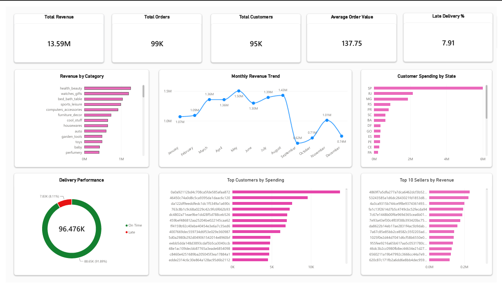
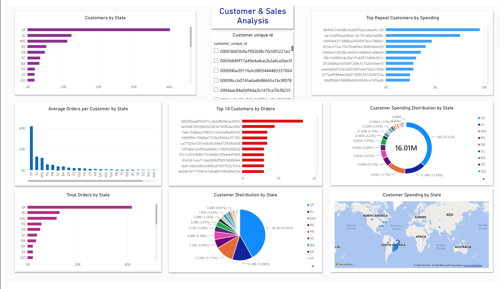
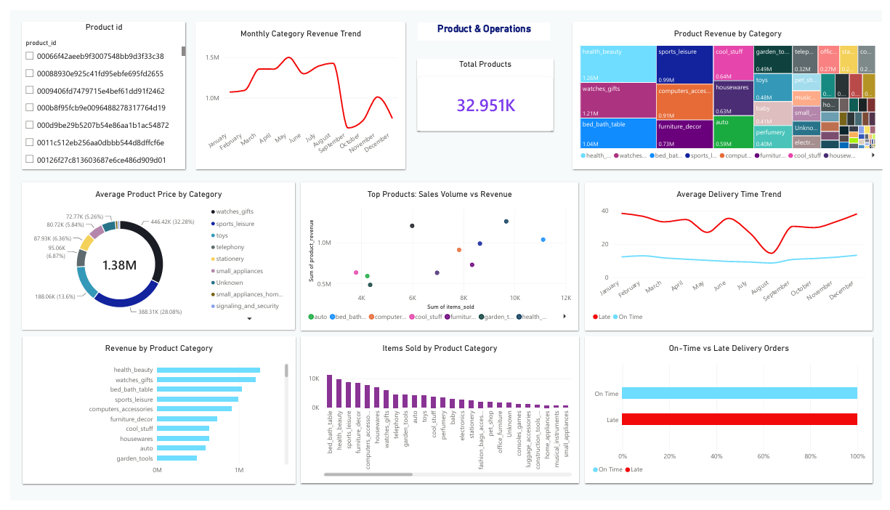

# Olist E-Commerce Sales & Customer Analytics

**End-to-end SQL + Power BI analytics project** analyzing 99K+ orders from the Olist Brazilian E-Commerce dataset — covering sales, customers, sellers, products, and delivery performance.


---

## 📌 Project Summary

This project simulates a real-world business analytics workflow: taking raw e-commerce data, validating and analyzing it in **PostgreSQL/SQL**, then building an **interactive Power BI dashboard** to surface insights for sales, customer, seller, product, and delivery performance.

It demonstrates practical skills relevant to **Data Analyst, Business Analyst, and BI Analyst** roles — from SQL business analysis and data validation to dashboard development and reporting.

---

## 🔑 Key Results at a Glance

| Metric | Value |
| ------ | ----- |
| Total Revenue | **$13.59M** |
| Total Orders | **98,666** |
| Average Order Value | **$137.75** |
| Total Customers | **95,420** |
| Repeat Customers | **2,997** |
| Total Sellers | **~3,095** |
| Total Products | **~32,951** |
| Late Delivery Rate | **~8%** |

> **Notes on metrics:** Customer and revenue counts vary slightly depending on which table joins and value fields (order-item price vs. price + freight + installment payments) a given view uses. The **$13.59M** revenue figure is product/order-item revenue from `vw_executive_kpis`; a payment-value-based view (used in the Customer & Sales page) totals closer to $16M. The **~8%** late-delivery figure is calculated from delivered orders where actual delivery date exceeded the estimated delivery date.

---

## 🛠️ Tools & Technologies

`PostgreSQL` · `SQL` · `Power BI` · `Git` · `GitHub`

---

## 🔄 Workflow

```text
Raw CSV Data
     ↓
PostgreSQL
     ↓
Data Quality Validation
     ↓
SQL Business Analysis
     ↓
Analytical SQL Views
     ↓
Power BI Dashboard
     ↓
Business Insights
```

---

## 📊 What's Included

### SQL Analysis — 50 Business Questions

Organized into 5 core business areas plus a dedicated data-quality file:

- **Sales Analysis** — revenue trends, top products, revenue by state/category, AOV
- **Customer Analysis** — customer segmentation, repeat customers, top spenders by state
- **Seller Analysis** — seller revenue, order volume, freight cost, revenue contribution
- **Delivery & Operations** — delivery times, late-order rates, estimated vs. actual delivery
- **Product & Category Analysis** — category revenue, growth trends, category ranking
- **Data Quality Validation** — missing values, duplicates, and data consistency checks

### 11 Analytical SQL Views

Reusable analytical views such as:

- `vw_executive_kpis`
- `vw_monthly_revenue`
- `vw_customer_summary`
- `vw_seller_summary`
- `vw_product_performance`
- `vw_delivery_performance`

These views create a structured reporting layer between the raw PostgreSQL tables and Power BI.

### Power BI Dashboard — 4 Pages

- **Executive Overview** — top-line KPIs and revenue trends
- **Customer & Sales Analysis** — customer behavior and geographic patterns
- **Seller Performance** — seller revenue, orders, products, and freight
- **Product & Operations** — category performance and delivery analysis

---

## 📊 Dashboard Preview

**Executive Overview**


**Customer & Sales Analysis**


**Product & Operations**


---

## 💡 Sample Business Insight

Revenue peaked mid-year at **$1.50M** (May) and **$1.43M** (August), before dropping sharply from September through December — down to roughly $0.62M–$0.74M — then partially recovering to **$1.01M** in November.

This dip likely reflects how the dataset's calendar-month view blends multiple years of data: 2016 only covers a short platform ramp-up period and 2018 data ends mid-year, so Sept–Dec figures are pulled down by incomplete years rather than representing a genuine seasonal decline. A useful next iteration would be trending revenue by **month-year** instead of month name alone, to separate real seasonality from this data-coverage artifact.

---

## 📁 Repository Structure

```
olist-ecommerce-analytics/
│
├── README.md
│
├── data/
│   └── Olist CSV datasets
│
├── sql/
│   ├── 01_sales_analysis.sql
│   ├── 02_customer_analysis.sql
│   ├── 03_seller_analysis.sql
│   ├── 04_delivery_operations.sql
│   ├── 05_product_category_analysis.sql
│   ├── 06_data_quality_validation.sql
│   │
│   └── views/
│       ├── vw_category_summary.sql
│       ├── vw_customer_summary.sql
│       ├── vw_delivery_performance.sql
│       ├── vw_executive_kpis.sql
│       ├── vw_monthly_category_growth.sql
│       ├── vw_monthly_revenue.sql
│       ├── vw_product_performance.sql
│       ├── vw_repeat_customers.sql
│       ├── vw_seller_revenue_contribution.sql
│       ├── vw_seller_summary.sql
│       ├── vw_top_customers.sql
│       └── verify_views.sql
│
├── powerbi/
│   └── Olist_Ecommerce_Sales_Customer_Analytics.pbit
│
├── screenshots/
│   ├── executive_overview.png
│   ├── customer_sales.png
│   └── product_operations.png
│
└── insights/
```

---

## 🧠 Skills Demonstrated

**SQL:** SELECT, WHERE, ORDER BY, GROUP BY, HAVING, aggregate functions, JOINs, subqueries, CTEs, CASE statements, date functions, window functions (LAG, ranking), data validation, analytical views

**PostgreSQL:** database querying, multi-table analysis, data quality validation, analytical view creation, business metric calculation

**Power BI:** KPI cards, bar/column/line charts, donut & pie charts, treemaps, scatter plots, gauges, maps, dashboard formatting, business-focused visualization

**Version Control:** Git, GitHub — repository management, commits, branch management

---

## ❓ Business Questions Answered

- How much revenue did the business generate, and how does it trend over time?
- Which categories, states, and products drive the most revenue?
- Who are the highest-spending and most frequent customers?
- How many customers are repeat customers?
- Which sellers generate the most revenue and orders?
- How much freight cost is associated with sellers?
- Which product categories are growing or declining?
- What percentage of deliveries are late, and how long does delivery take?
- How does actual delivery compare with estimated delivery?

*The complete set of 50 SQL business questions and solutions is available in the `/sql` folder.*

---

## 🔍 Data Quality Validation

A dedicated SQL validation file covers:

- Missing delivery dates
- Order status distribution
- Duplicate order IDs
- Missing product categories
- Missing product dimensions
- Missing review scores
- Missing payment values
- Duplicate product IDs
- Missing customer states
- Missing seller states
- Missing customer IDs
- Duplicate customer IDs

**Example validation result:**

```
Total Orders                  : 99,441
Delivered Orders              : 96,476
Orders with Missing Delivery  : 2,965
```

---

## 🚀 How to Run This Project

**1. Clone the repository**
```bash
git clone https://github.com/kartickpal/olist-ecommerce-analytics.git
cd olist-ecommerce-analytics
```

**2. Set up PostgreSQL**

Create a PostgreSQL database named `olist_company`, then import the Olist CSV datasets into the corresponding tables.

**3. Run the SQL analysis**

Execute the SQL files in `/sql`, in order:
```
01_sales_analysis.sql
02_customer_analysis.sql
03_seller_analysis.sql
04_delivery_operations.sql
05_product_category_analysis.sql
06_data_quality_validation.sql
```

**4. Create the analytical views**

Run the SQL files inside `sql/views/` — these provide the reporting layer used by Power BI.

**5. Open the Power BI template**

Open `powerbi/Olist_Ecommerce_Sales_Customer_Analytics.pbit`, connect it to your PostgreSQL database, and refresh the data.

---

## 🎯 Project Objective

This project demonstrates an end-to-end analytics workflow:

```
Raw E-Commerce Data → Data Validation → SQL Business Analysis
→ Analytical Views → Power BI Dashboard → Business Insights
```

It reflects practical skills applicable to entry-level **Data Analyst, Business Analyst, SQL Analyst, and BI Analyst** roles.

---

## 👤 Author

**Kartick Pal**

B.Tech — Computer Science & Engineering
GitHub: [github.com/kartickpal](https://github.com/kartickpal)
